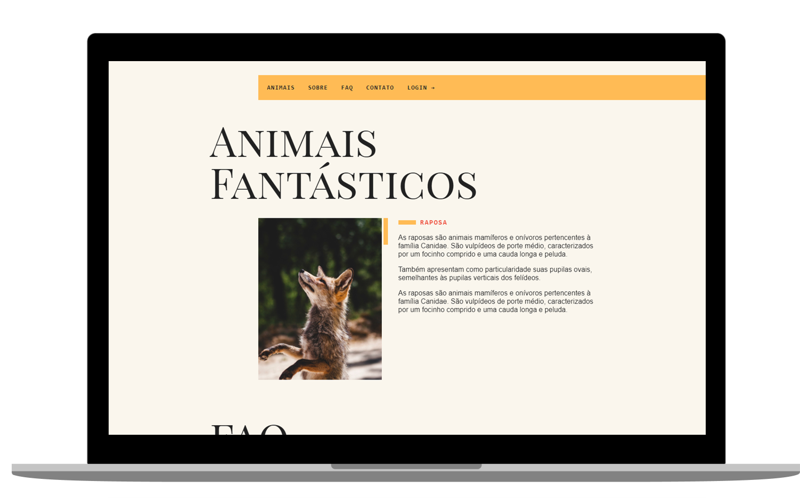

<h1 align="center">
  ANIMAIS FANTASTICOS
</h1>

   
  
  
  

  

  

## ◾ Projeto

O Site Animais Fantasticos é um projeto totalmente responsivo feito com Javascript puro. O principal intuito era masterizar o conhecimento em Javascript.

#### Visitar o site: [AnimaisFantasticos.com](https://origamid.github.io/animais-fantasticos/)

## ◾ Tecnologias

Esse projeto foi desenvolvido com as seguintes tecnologias:

- [HTML](https://developer.mozilla.org/pt-BR/docs/Web/HTML)
- [CSS](https://developer.mozilla.org/pt-BR/docs/Web/CSS)
- [JAVASCRIPT](https://developer.mozilla.org/pt-BR/docs/Web/JavaScript)

## ◾ Licença

Esse projeto está sob a licença MIT.

 
